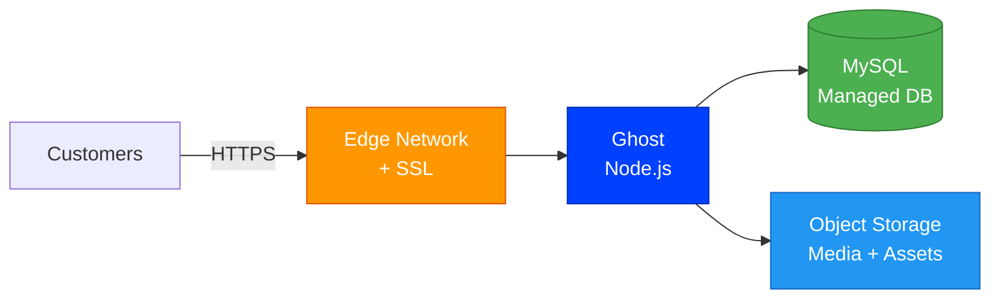
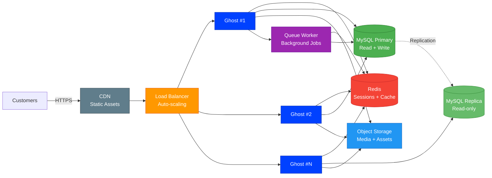

# Ghost    

A powerful publishing platform for blogs, newsletters, and membership sites. Ghost is a modern, open-source CMS with built-in email newsletters, memberships, and subscriptions.

> **Credits**: Built on [Ghost](https://ghost.org) by [Ghost Foundation](https://github.com/TryGhost). All trademarks belong to their respective owners.

## Local Development

Copy `.env.example` to `.env` and set strong passwords before starting:

    cp .env.example .env
    # Edit .env and set MYSQL_PASSWORD and MYSQL_ROOT_PASSWORD
    docker compose up

Visit http://localhost:2368 for the site and http://localhost:2368/ghost for admin.

## Deploy on StackBlaze

This template includes a `stackblaze.yaml` for one-click deployment on [StackBlaze](https://stackblaze.com). Both options run on **Kubernetes** for reliability and scalability.

<strong>Standard Deployment</strong> — Single-instance Kubernetes setup for startups and moderate traffic

 

**What you get:**
- Single Ghost instance on Kubernetes
- Managed MySQL database
- Automatic SSL/TLS via StackBlaze edge network
- Object storage for media and assets
- Automated daily backups
- Zero-downtime deploys

**Best for:** Development, staging, and moderate-traffic production environments.

<strong>High Availability Deployment</strong> — Multi-instance Kubernetes setup for business-critical production

 

**What you get:**
- Auto-scaling Ghost pods on Kubernetes behind a load balancer
- Redis for shared sessions, cache, and queue management
- MySQL primary + read replica for high throughput
- CDN for static assets (images, CSS, JS)
- Background queue workers for async processing
- Shared object storage across all instances
- Automated failover and self-healing
- Zero-downtime rolling deploys

**Best for:** Production workloads, high-traffic applications, business-critical deployments.

---

## Security Configuration

The following environment variables **must** be set to non-default values before running in production:

| Variable | Description | Required |
|---|---|---|
| `MYSQL_PASSWORD` | MySQL password for the `ghost` user | **Yes** |
| `MYSQL_ROOT_PASSWORD` | MySQL root password | **Yes** |
| `GHOST_URL` | Public URL of your Ghost site (e.g. `https://example.com`) | **Yes** |
| `MYSQL_DATABASE` | MySQL database name (default: `ghost`) | No |
| `MYSQL_USER` | MySQL username (default: `ghost`) | No |

> **Warning:** Never use the placeholder passwords from `.env.example` in production. Generate strong, random passwords (e.g. `openssl rand -base64 32`).

Ghost handles its own admin setup on first run — no default admin credentials are shipped. Complete the setup wizard at `<your-url>/ghost` immediately after deployment.

---

### Maintained by [StackBlaze](https://stackblaze.com)

This template is actively maintained by StackBlaze. We perform **weekly automated checks** to ensure:

- **Up-to-date dependencies** — frameworks, libraries, and base images are kept current
- **Security scanning** — continuous monitoring for known vulnerabilities and CVEs
- **Best practices** — configurations follow current recommendations from upstream projects

Found an issue? [Open a ticket](https://github.com/stackblaze-templates/ghost/issues).
